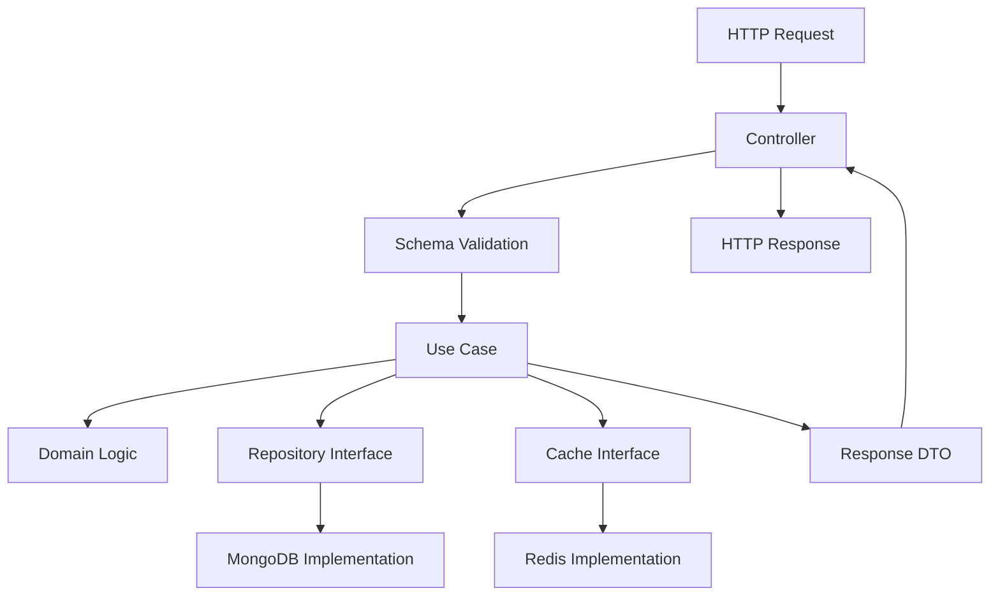

# 🏛️ Arquitetura - API v2.0

## 📐 Visão Geral da Arquitetura Hexagonal

A API de Consulta e Cobranças v2.0 foi projetada seguindo os princípios da **Arquitetura Hexagonal** (também conhecida como Ports & Adapters), que proporciona:

- 🔄 **Baixo acoplamento** entre camadas
- 🧪 **Alta testabilidade** com mocks e interfaces
- 🔌 **Flexibilidade** para trocar implementações
- 📏 **Separação clara** de responsabilidades
- 🛡️ **Isolamento** da lógica de negócio

## 🏗️ Estrutura das Camadas

### 1️⃣ **Domain Layer** (Centro) ✅ **IMPLEMENTADA**

**Localização**: `src/domain/`

**Responsabilidades**:
- Conter a lógica de negócio pura
- Definir entidades e value objects
- Ser independente de frameworks externos

**Componentes Implementados**:

#### 📦 **Entidades**
```python
# src/domain/entities/cliente.py
@dataclass
class Cliente:
    nome: str
    cpf: CPF
    email: Email
    telefone: str
    endereco: Endereco
    # + métodos de validação e negócio

# src/domain/entities/pagamento.py  
@dataclass  
class Pagamento:
    cliente_id: str
    valor: Money
    metodo: str
    status: str
    # + métodos aprovar(), rejeitar(), cancelar()

# src/domain/entities/boleto.py
@dataclass
class Boleto:
    cliente_id: str
    valor: Money
    data_vencimento: datetime
    linha_digitavel: str
    # + métodos pagar(), cancelar(), esta_vencido()
```

#### 💎 **Value Objects**
```python
# src/domain/value_objects/cpf.py
@dataclass(frozen=True)
class CPF:
    numero: str
    # + validação com algoritmo oficial

# src/domain/value_objects/email.py
@dataclass(frozen=True)  
class Email:
    endereco: str
    # + validação regex

# src/domain/value_objects/money.py
@dataclass(frozen=True)
class Money:
    amount: Decimal
    currency: str = "BRL"
    # + operações matemáticas seguras
```

### 2️⃣ **Application Layer** (Orquestração) ✅ **IMPLEMENTADA**

**Localização**: `src/application/`

**Responsabilidades**:
- Orquestrar casos de uso
- Coordenar domain e infrastructure
- Definir interfaces (ports)
- Gerenciar transações e cache

**Componentes Implementados**:

#### 🎯 **Use Cases** (12 implementados)
```python
# Autenticação (2)
class AutenticarUsuarioUseCase:
    async def execute(request: LoginRequestDTO) -> TokenDTO

class RenovarTokenUseCase:
    async def execute(request: RefreshTokenDTO) -> TokenDTO

# Cliente (3)
class BuscarClienteUseCase:
    async def execute(cliente_id: str) -> BuscarClienteResponseDTO

class CriarClienteUseCase:
    async def execute(request: CriarClienteRequestDTO) -> CriarClienteResponseDTO

class AtualizarClienteUseCase:
    async def execute(request: AtualizarClienteRequestDTO) -> AtualizarClienteResponseDTO

# Pagamento (2)
class ProcessarPagamentoUseCase:
    async def execute(request: ProcessarPagamentoRequestDTO) -> ProcessarPagamentoResponseDTO

class ConsultarPagamentoUseCase:
    async def execute(pagamento_id: str) -> ConsultarPagamentoResponseDTO

# Boleto (3)
class GerarBoletoUseCase:
    async def execute(request: GerarBoletoRequestDTO) -> GerarBoletoResponseDTO

class ConsultarBoletoUseCase:
    async def execute(boleto_id: str) -> ConsultarBoletoResponseDTO

class CancelarBoletoUseCase:
    async def execute(boleto_id: str, motivo: str) -> CancelarBoletoResponseDTO
```

#### 🔌 **Interfaces (Ports)**
```python
# Repositories
class IClienteRepository(ABC):
    async def salvar(cliente: Cliente) -> Cliente
    async def buscar_por_id(cliente_id: str) -> Optional[Cliente]
    # + outros métodos CRUD

class IPagamentoRepository(ABC): ...
class IBoletoRepository(ABC): ...

# Services  
class IJWTService(ABC):
    def create_access_token(data: dict, expires_delta: timedelta) -> str
    def verify_token(token: str) -> Optional[dict]

class ICacheService(ABC):
    async def get(key: str) -> Optional[dict]
    async def set(key: str, value: dict, ttl: int) -> bool
```

#### 📦 **DTOs (Data Transfer Objects)**
```python
# Input/Output para cada use case
@dataclass
class CriarClienteRequestDTO:
    nome: str
    cpf: str
    email: str
    telefone: str
    endereco: EnderecoDTO

@dataclass  
class CriarClienteResponseDTO:
    cliente_id: str
    mensagem: str
    data_cadastro: datetime
```

### 3️⃣ **Infrastructure Layer** (Adaptadores) 🚧 **EM DESENVOLVIMENTO**

**Localização**: `src/infrastructure/` (a ser criada)

**Responsabilidades**:
- Implementar interfaces da application layer
- Gerenciar conexões com banco e cache
- Integrar com APIs externas
- Prover serviços técnicos

**Componentes Planejados**:

#### 🗄️ **Repositories (Adapters)**
```python
# src/infrastructure/repositories/mongodb_cliente_repository.py
class MongoDBClienteRepository(IClienteRepository):
    def __init__(self, database: Database):
        self.collection = database.clientes
    
    async def salvar(self, cliente: Cliente) -> Cliente:
        # Implementação MongoDB
        
    async def buscar_por_id(self, cliente_id: str) -> Optional[Cliente]:
        # Implementação MongoDB
```

#### 🔧 **Services (Adapters)**
```python
# src/infrastructure/services/redis_cache_service.py
class RedisCacheService(ICacheService):
    def __init__(self, redis_client: Redis):
        self.redis = redis_client
    
    async def get(self, key: str) -> Optional[dict]:
        # Implementação Redis

# src/infrastructure/services/jwt_service.py  
class JWTService(IJWTService):
    def __init__(self, secret_key: str):
        self.secret_key = secret_key
    
    def create_access_token(self, data: dict, expires_delta: timedelta) -> str:
        # Implementação JWT
```

### 4️⃣ **Presentation Layer** (Interface) 🚧 **REFATORAÇÃO PENDENTE**

**Localização**: `src/presentation/` (a ser refatorada de `src/main.py`)

**Responsabilidades**:
- Receber requisições HTTP
- Validar entrada com Pydantic
- Chamar use cases apropriados
- Formatar respostas JSON

**Componentes Planejados**:

#### 🎮 **Controllers**
```python
# src/presentation/controllers/cliente_controller.py
class ClienteController:
    def __init__(self, 
                 buscar_cliente_use_case: BuscarClienteUseCase,
                 criar_cliente_use_case: CriarClienteUseCase):
        self.buscar_cliente_use_case = buscar_cliente_use_case
        self.criar_cliente_use_case = criar_cliente_use_case
    
    async def buscar_cliente(self, cliente_id: str) -> BuscarClienteResponse:
        # Chama use case e formata resposta
```

#### 📋 **Schemas**
```python
# src/presentation/schemas/cliente_schemas.py
class CriarClienteRequest(BaseModel):
    nome: str = Field(..., min_length=2, max_length=100)
    cpf: str = Field(..., regex=r"^\d{11}$")
    email: EmailStr
    # + validações Pydantic
```

## 🔄 Fluxo de Dados

### **Requisição HTTP → Resposta JSON**



### **Exemplo Prático: Criar Cliente**

1. **Presentation**: Controller recebe POST `/clientes`
2. **Presentation**: Schema valida dados (Pydantic)
3. **Application**: Use case `CriarClienteUseCase.execute()`
4. **Domain**: Cria entidade `Cliente` e valida CPF
5. **Infrastructure**: Repository salva no MongoDB
6. **Infrastructure**: Cache invalida dados relacionados
7. **Application**: Retorna DTO de resposta
8. **Presentation**: Controller formata JSON response

## 🧪 Benefícios da Arquitetura

### **1. Testabilidade** 
```python
# Mock das interfaces para testes
class MockClienteRepository(IClienteRepository):
    async def salvar(self, cliente: Cliente) -> Cliente:
        return cliente  # Simulação para teste

# Teste isolado do use case
async def test_criar_cliente():
    mock_repo = MockClienteRepository()
    use_case = CriarClienteUseCase(mock_repo)
    result = await use_case.execute(request_dto)
    assert result.cliente_id is not None
```

### **2. Flexibilidade**
```python
# Trocar MongoDB por PostgreSQL sem afetar use cases
class PostgreSQLClienteRepository(IClienteRepository):
    # Mesma interface, implementação diferente
    
# Trocar Redis por Memcached
class MemcachedCacheService(ICacheService):
    # Mesma interface, implementação diferente
```

### **3. Manutenibilidade**
- **Camada Domain**: Lógica de negócio centralizada
- **Camada Application**: Casos de uso bem definidos  
- **Interfaces**: Contratos claros entre camadas
- **Separation of Concerns**: Cada camada tem responsabilidade única

## 🎯 Dependency Injection

### **Configuração (Planejada)**
```python
# src/infrastructure/di/container.py
class DIContainer:
    def configure_repositories(self):
        self.cliente_repository = MongoDBClienteRepository(self.database)
        self.pagamento_repository = MongoDBPagamentoRepository(self.database)
        
    def configure_services(self):
        self.cache_service = RedisCacheService(self.redis)
        self.jwt_service = JWTService(self.config.secret_key)
        
    def configure_use_cases(self):
        self.buscar_cliente_use_case = BuscarClienteUseCase(
            self.cliente_repository,
            self.cache_service
        )
```

## 📊 Padrões Implementados

### **Repository Pattern** ✅
- Abstração de persistência
- Interfaces bem definidas
- Implementações intercambiáveis

### **Use Case Pattern** ✅  
- Casos de uso isolados
- Single Responsibility Principle
- Fácil testabilidade

### **DTO Pattern** ✅
- Transferência de dados segura
- Validação de entrada/saída
- Desacoplamento entre camadas

### **Dependency Inversion** ✅
- Dependências abstratas (interfaces)
- Inversão de controle
- Alta modularidade

## 🚀 Próximos Passos Arquiteturais

1. **Implementar Infrastructure Layer**
   - MongoDB repositories
   - Redis cache service  
   - JWT authentication service

2. **Refatorar Presentation Layer**
   - Controllers usando dependency injection
   - Schemas Pydantic atualizados
   - Error handlers padronizados

3. **Configurar Dependency Injection**
   - Container de dependências
   - Factory patterns
   - Configuration management

4. **Adicionar Cross-Cutting Concerns**
   - Logging interceptors
   - Validation decorators
   - Transaction management
   - Rate limiting middleware
