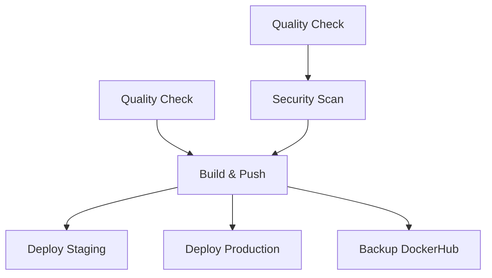

# 🚀 CI/CD Pipeline Documentation

## 📋 Visão Geral

Este documento descreve o pipeline de CI/CD implementado para a API Consulta v2, baseado em GitHub Actions com foco em qualidade, segurança e deployment automatizado.

## 🏗️ Estrutura do Pipeline

### **Pipeline Triggers**
- **Push**: branches `main` e `develop`
- **Pull Request**: para branch `main`
- **Manual**: via workflow_dispatch com seleção de ambiente

### **6 Jobs Paralelos e Sequenciais**



## 🔍 Job 1: Quality Checks & Tests

### **Funcionalidades:**
- ✅ **Code Formatting**: Black, isort
- ✅ **Linting**: Flake8 com configurações personalizadas
- ✅ **Type Checking**: MyPy com strict settings
- ✅ **Unit Tests**: pytest com coverage report
- ✅ **Coverage Upload**: Codecov integration

### **Configurações de Qualidade:**
```yaml
# pyproject.toml
[tool.black]
line-length = 88
target-version = ['py311']

[tool.pytest.ini_options]
minversion = "6.0"
addopts = "-ra -q --strict-markers"
```

### **Métricas:**
- **Coverage mínimo**: 80%
- **Type hints**: 100% em código novo
- **Max line length**: 88 caracteres

## 🔒 Job 2: Security Scan

### **Ferramentas Implementadas:**
- **Safety**: Verificação de vulnerabilidades em dependências
- **Bandit**: Análise de segurança do código Python
- **Container Scanning**: Análise de vulnerabilidades da imagem Docker

### **Reports Gerados:**
- `bandit-report.json`: Relatório detalhado de segurança
- Upload automático para artifacts do GitHub

## 🏗️ Job 3: Build & Push Docker Image

### **Recursos Avançados:**
- **Multi-stage build**: Otimização de tamanho da imagem
- **BuildKit cache**: Cache inteligente entre builds
- **Multi-platform**: Suporte para linux/amd64
- **Metadata extraction**: Tags automáticas baseadas em branch/SHA

### **Strategy de Tags:**
```yaml
tags: |
  type=ref,event=branch        # main, develop
  type=ref,event=pr           # pr-123
  type=sha,prefix={{branch}}- # main-abc1234
  type=raw,value=latest       # latest (apenas main)
```

### **Dockerfile Otimizado:**
```dockerfile
# Multi-stage build
FROM python:3.11-slim as builder
# ... build dependencies

FROM python:3.11-slim as production
# ... production optimizations
```

## 🚀 Job 4 & 5: Deploy (Staging & Production)

### **Ambientes Configurados:**
- **Staging**: Deploys automáticos do branch `develop`
- **Production**: Deploys automáticos do branch `main`
- **Manual**: Seleção via workflow_dispatch

### **Environment Protection:**
- **Required reviewers**: Configurado no GitHub
- **Deployment restrictions**: Apenas branches específicos
- **Secrets isolation**: Separação por ambiente

## 💾 Job 6: Backup DockerHub

### **Funcionalidade:**
- Backup automático das imagens para DockerHub
- Múltiplas tags para versionamento
- Execução apenas no branch `main`

## 🔧 Secrets Necessários

### **DigitalOcean Registry:**
```
DO_REGISTRY=registry.digitalocean.com/your-registry
DOCKER_USERNAME=your-do-token
DOCKER_PASSWORD=your-do-token
```

### **DockerHub:**
```
DOCKER_HUB_USERNAME=your-dockerhub-username
DOCKER_HUB_PASSWORD=your-dockerhub-token
```

### **Codecov (opcional):**
```
CODECOV_TOKEN=your-codecov-token
```

## 📊 Métricas e Monitoramento

### **Build Times:**
- **Quality Check**: ~3-5 minutos
- **Security Scan**: ~2-3 minutos
- **Build & Push**: ~5-7 minutos
- **Total Pipeline**: ~10-15 minutos

### **Cache Strategy:**
- **Pip cache**: Dependências Python
- **Docker BuildKit**: Layers Docker
- **GitHub Actions cache**: Artifacts temporários

## 🎯 Boas Práticas Implementadas

### **1. Security First:**
- Dependências auditadas automaticamente
- Código escaneado por vulnerabilidades
- Imagens Docker com usuário não-root
- Multi-stage builds para reduzir surface de ataque

### **2. Quality Gates:**
- Testes obrigatórios antes do merge
- Coverage mínimo enforçado
- Linting e formatação automáticos
- Type checking rigoroso

### **3. DevOps Excellence:**
- Infrastructure as Code
- Gitflow com protection rules
- Automated dependency updates via Dependabot
- Comprehensive logging e monitoring

### **4. Developer Experience:**
- Feedback rápido nos PRs
- Comandos Make para desenvolvimento local
- Docker Compose para ambiente dev
- Documentação abrangente

## 🔄 Workflow de Desenvolvimento

### **Feature Development:**
```bash
# 1. Criar feature branch
git checkout -b feature/nova-funcionalidade

# 2. Desenvolvimento local
make dev           # Ambiente de desenvolvimento
make test         # Rodar testes
make quality      # Verificar qualidade

# 3. Commit e push
git add .
git commit -m "feat: nova funcionalidade"
git push origin feature/nova-funcionalidade

# 4. Criar PR
# Pipeline roda automaticamente quality + security
```

### **Deploy para Staging:**
```bash
# 1. Merge para develop
git checkout develop
git merge feature/nova-funcionalidade

# 2. Push para develop
git push origin develop
# Deploy automático para staging
```

### **Deploy para Production:**
```bash
# 1. Merge develop -> main
git checkout main
git merge develop

# 2. Push para main
git push origin main
# Deploy automático para production + backup DockerHub
```

## 🛠️ Comandos de Desenvolvimento

### **Setup Inicial:**
```bash
make init          # Inicializar projeto
make dev           # Ambiente de desenvolvimento
```

### **Desenvolvimento:**
```bash
make test          # Rodar testes
make lint          # Verificar código
make format        # Formatar código
make security      # Verificar segurança
make quality       # Rodar todas verificações
```

### **Docker:**
```bash
make docker-build  # Build da imagem
make docker-run    # Rodar container
make docker-logs   # Ver logs
```

## 📋 Troubleshooting

### **Problemas Comuns:**

**1. Testes falhando:**
```bash
# Executar localmente
make test
# Verificar coverage
make test-unit
```

**2. Linting errors:**
```bash
# Auto-fix formatting
make format
# Verificar problemas
make lint
```

**3. Security issues:**
```bash
# Verificar vulnerabilidades
make security
# Atualizar dependências
pip-review --auto
```

**4. Docker build failing:**
```bash
# Build local
make docker-build
# Verificar logs
make docker-logs
```

## 🔄 Continuous Improvement

### **Próximas Melhorias:**
- [ ] Integration tests com test containers
- [ ] Performance testing automatizado
- [ ] Blue/Green deployment
- [ ] Canary deployments
- [ ] Notification webhooks (Slack/Teams)
- [ ] Cost optimization tracking
- [ ] Advanced monitoring com Grafana
- [ ] Database migration automation

### **Métricas para Acompanhar:**
- **MTTR** (Mean Time To Recovery)
- **Deployment frequency**
- **Lead time for changes**
- **Change failure rate**
- **Security vulnerability detection time**

## 📞 Suporte

Para problemas com o pipeline:
1. Verificar [GitHub Actions logs](https://github.com/acthiago/api-consulta-v2/actions)
2. Consultar este documento
3. Verificar secrets no repositório
4. Abrir issue no repositório

**Mantido por**: GitHub Copilot Assistant & @acthiago
